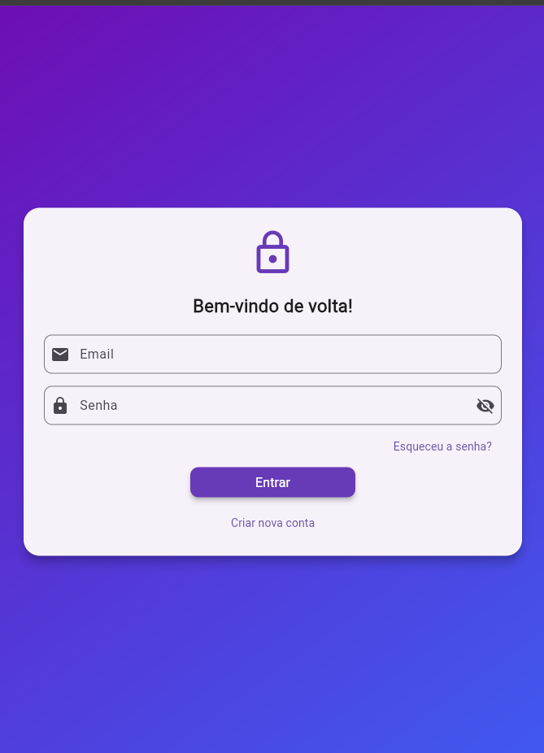

# 📱 Painel de Login em Flutter

Este é um projeto Flutter simples de **painel de login**, desenvolvido como parte da atividade da disciplina de [Nome da Disciplina] sob orientação do professor [Nome do Professor].

## ✨ Funcionalidades

- Tela de login com campos de e-mail e senha
- Botão de "Entrar"
- Design simples e responsivo

## 🛠 Tecnologias utilizadas

- [Flutter](https://flutter.dev/)
- [Dart](https://dart.dev/)

## 📷 Captura de tela

